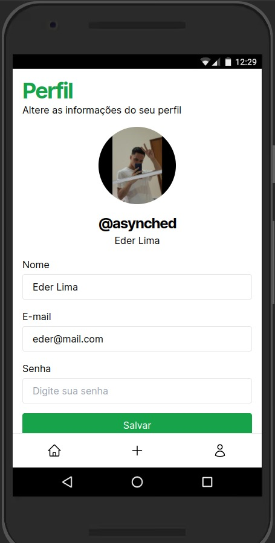

# Plano de desenvolvimento

O objetivo para a aplicação era a construção uma interface web, acessível de todos os dispositivos, porém com foco em dispositivos móveis, para que o usuário possa realizar o cadastro dos pontos de coleta de lixo reciclável, e também para que o usuário possa visualizar e criar reviews para os pontos de coleta de lixo cadastrados.

Para que isso fosse possível, iniciamos pela modelagem das tabelas de um banco de dados, mapeando as entidades e os relacionamentos. Sabendo da criação dos pontos de coletas e review, iniciamos com suas respectivas tabelas.

Para a tabela de usuários escolhemos armazenar os seguintes campos, id, nome, usuário, e-mail, senha, url do avatar e datas para controle do banco de dados. A descrição da tabela de usuários pode ser encontrada abaixo.

| Campo      | Tipo         | Descrição                      |
| ---------- | ------------ | ------------------------------ |
| id         | integer      | Identificador único do usuário |
| name       | text         | Nome do usuário                |
| username   | text (único) | Nome de usuário para login     |
| email      | text (único) | Email do usuário               |
| password   | text         | Senha do usuário               |
| avatar_url | text         | URL da imagem do usuário       |
| created_at | timestamp    | Data de criação do usuário     |
| updated_at | timestamp    | Data de atualização do usuário |

Com relação a tabela de pontos de coleta, armazenamos as informações de id, nome do ponto de coleta, endereço, cidade, estado, id do usuário, datas para controle e um valor booleano de "verificado" para exibir um selo para o usuário de que o ponto de coleta é válido. Os campos da tabela são apresentados abaixo.

| Campo      | Tipo      | Descrição                                                |
| ---------- | --------- | -------------------------------------------------------- |
| id         | integer   | Identificador único do ponto de coleta                   |
| name       | text      | Nome do ponto de coleta                                  |
| address    | text      | Endereço do ponto de coleta                              |
| city       | text      | Cidade do ponto de coleta                                |
| state      | text      | Estado do ponto de coleta                                |
| verified   | boolean   | Indica se o ponto de coleta foi verificado               |
| user_id    | integer   | Identificador do usuário que cadastrou o ponto de coleta |
| created_at | timestamp | Data de criação do ponto de coleta                       |
| updated_at | timestamp | Data de atualização do ponto de coleta                   |

Por último, a tabela de reviews, que armazena as informações de id, id do usuário, id do ponto de coleta, nota, comentário e datas para controle.

| Campo      | Tipo      | Descrição                                   |
| ---------- | --------- | ------------------------------------------- |
| id         | integer   | Identificador único da review               |
| user_id    | integer   | Identificador do usuário que criou a review |
| point_id   | integer   | Identificador do ponto de coleta da review  |
| rating     | integer   | Nota da review                              |
| comment    | text      | Comentário da review                        |
| created_at | timestamp | Data de criação da review                   |
| updated_at | timestamp | Data de atualização da review               |

No final da modelagem, adicionamos outras tabelas que seriam necessárias para uma aplicação web, como a tabela de sessões e tabelas que armazenam arquivos relacionados as entidades principais da aplicação. A modelagem final é representada na imagem abaixo.

Com a definição do banco de dados, iniciamos a prototipação das telas da aplicação. Inicialmente com a ideia de fazer formulários de login e cadastro, contendo os campos definidos nas tabelas. O objetivo de cada tela é reduzir o máximo de quantidade de informação, para que o usuário não se sinta sobrecarregado com muitas informações. As telas de login e cadastro podem ser vistas abaixo.

| Login                      | Cadastro                         |
| -------------------------- | -------------------------------- |
|  |  |

Definidos os conceitos iniciais da interface gráfica inicializamos o desenvolvimento de provas de conceito da aplicação. Inicialmente com o desenvolvimento de páginas estáticas, para realizar a conexão com um back-end posteriormente. As duas primeiras páginas desenvolvidas foram login e cadastro, seguindo o padrão definido nos wireframes iniciais. As páginas podem ser vistas abaixo.

| Login                             | Cadastro                                |
| --------------------------------- | --------------------------------------- |
|  |  |

Continuamos o desenvolvimento definindo a página inicial e a página de cadastro de pontos de coleta. A página inicial foi desenvolvida com o objetivo de apresentar os pontos de coleta cadastrados, com informações gerais a respeito do ponto. A página de cadastro de pontos de coleta foi desenvolvida com o objetivo de permitir que o usuário possa cadastrar um ponto de coleta, adicionando imagens e definindo os campos de endereço, cidade e estado. As páginas podem ser vistas abaixo.

| Página inicial                  | Cadastro de ponto                                   |
| ------------------------------- | --------------------------------------------------- |
|  |  |

Prosseguimos o desenvolvimento com o desenvolvimento da página que detalha as informações dos pontos de coleta, nela apresentamos as imagens cadastradas no formulário anterior e as informações em mais detalhes, além das reviews criadas por usuários da aplicação. A imagem abaixo mostra o resultado final do desenvolvimento.

| Detalhes do ponto de coleta          |
| ------------------------------------ |
|  |

Por último, criamos uma página onde o usuário pudesse alterar as informações do seu perfil, como nome, e-mail e senha, além de um botão que permitisse que o usuário saísse da sua conta atual.

| Alterar perfil                              |
| ------------------------------------------- |
|  |
